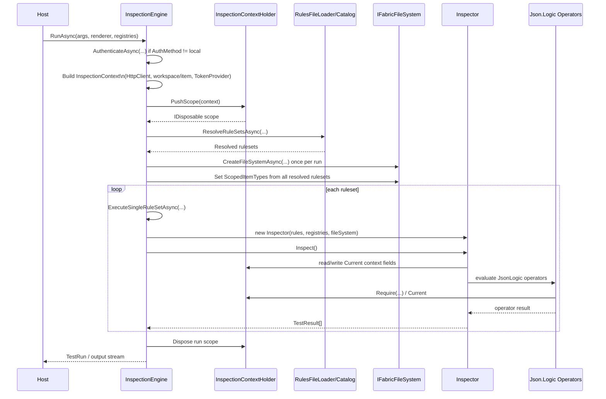
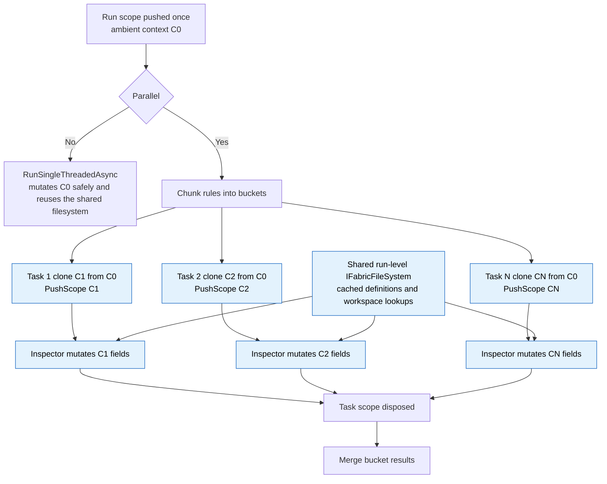
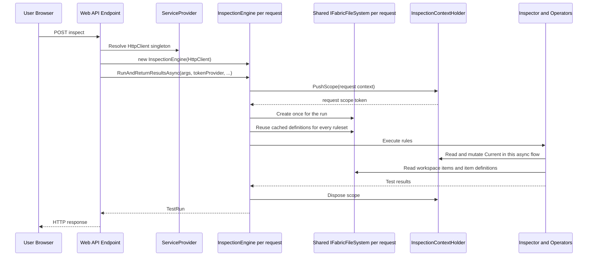
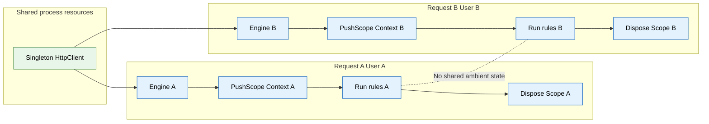

# FabInspector Core Architecture

This document explains the inspection execution model after the Dependency Injection refactor, with emphasis on:

- Per-run `InspectionEngine` isolation
- Ambient `InspectionContext` flow through `InspectionContextHolder`
- The DI composition hook `ServiceCollectionExtensions.AddFabInspectorCore`

The isolation boundary is the inspection request or run: mutable engine and ambient context state stay isolated, while the run-level `IFabricFileSystem` is reused within that request so item-definition downloads can be cached across rulesets and parallel buckets.

## 1. Runtime components

- `FabInspector.ClientLibrary.Hosting.ServiceCollectionExtensions.AddFabInspectorCore`
  - Registers process-wide collaborators (currently singleton `HttpClient`).
- `FabInspector.ClientLibrary.InspectionEngine`
  - Per-run coordinator.
  - Pushes ambient `InspectionContext` for the run.
  - Creates and reuses one `IFabricFileSystem` per run so workspace item definitions can be cached across rulesets and parallel buckets.
  - Splits rule execution into single-thread or parallel pathways.
- `FabInspector.Core.Inspection.InspectionContext`
  - Single POCO carrying run-level and per-rule/per-part mutable fields.
- `FabInspector.Core.Inspection.InspectionContextHolder`
  - Single `AsyncLocal<InspectionContext?>` slot with `PushScope(...)`, `Current`, `Require(...)`.
- `FabInspector.Core.Inspector`
  - Executes rule traversal and mutates context fields (`RuleName`, `Part`, `ItemPath`, `FabricItem`) as traversal advances.

## 2. DI composition and object lifetime

```mermaid
flowchart LR
  A["Host startup<br/>CLI WinForm Web"] --> B["Create ServiceCollection"]
  B --> C["Call AddFabInspectorCore"]
  C --> D["Register singleton HttpClient"]
  D --> E["Build ServiceProvider"]

  E --> F["Inspection request arrives"]
  F --> G["Resolve or reuse singleton HttpClient"]
  G --> H["Construct new InspectionEngine with HttpClient"]
  H --> I["Resolve rulesets and create one shared IFabricFileSystem per run"]
  I --> J["RunAsync or RunAndReturnResultsAsync"]

  classDef single fill:#e8f5e9,stroke:#2e7d32,stroke-width:1px,color:#000
  classDef perrun fill:#fff8e1,stroke:#f9a825,stroke-width:1px,color:#000
  class D single
  class H,I,J perrun
```

Notes:

- `HttpClient` is intentionally singleton and shared process-wide.
- `InspectionEngine` is intentionally transient/per-run.
- Hosts can execute concurrent runs safely by creating separate engine instances.

## 3. End-to-end inspection run flow

## 4. Concurrent flow and per-task ambient cloning

When `args.Parallel == true`, `InspectionEngine.ExecuteSingleRuleSetAsync(...)` chunks rules and runs buckets concurrently.

Critical detail:

- A single shared ambient context would race because `Inspector` mutates fields like `RuleName`, `Part`, `ItemPath`, and `FabricItem`.
- To prevent this, each parallel task creates `perTaskContext = ambient with { }` and pushes it via `InspectionContextHolder.PushScope(...)`.
- The run-level `IFabricFileSystem` is intentionally shared because its remote item-definition cache is thread-safe and should serve all buckets in the same run.

## 5. Ambient context semantics

`InspectionContextHolder` behaves like a stack per async flow:

Operational rules:

- Operators that require context call `InspectionContextHolder.Require(operatorName)` and fail fast with a clear message when missing.
- Operator progress flows through `InspectionContextHolder.ReportOperatorProgress(...)`, which formats messages using ambient `RuleName`, `Part`, and `ItemPath`.
- `Inspector` may create a local fallback scope only when invoked without a parent scope (legacy direct-instantiation paths), but remote operators still fail if token/host state is unavailable.

## 6. Mutation map (what changes during a run)

Stable for the run (typically set once by `InspectionEngine`):

- `InspectionContext.HttpClient`
- `InspectionContext.FabricWorkspaceId`
- `InspectionContext.TokenProvider`

Mutated during traversal:

- `InspectionContext.FabricItem` (updated per discovered item in workspace-scoped iteration)
- `InspectionContext.RuleName`
- `InspectionContext.PartQuery`
- `InspectionContext.Part`
- `InspectionContext.ItemPath`
- `InspectionContext.MessageReporter`

Because those mutable fields are evaluation-local, parallel paths must not share a single mutable context instance.

## 7. Compatibility path

- `Main` remains a static facade for CLI/WinForm/MCP compatibility.
- Each static entrypoint still constructs a fresh `InspectionEngine` per call.
- The static event (`WinMessageIssued`) is a forwarding surface from per-engine `MessageIssued` events.

This keeps existing host code working while preserving per-run isolation guarantees.

## 8. Multi-user web backend isolation model

In a multi-user web host (for example ASP.NET Core / Blazor Server), the isolation boundary is the inspection request.
Each request constructs a new `InspectionEngine` and gets its own ambient `InspectionContext` scope.

Recommended host behavior:

- Use `AddFabInspectorCore()` once at startup for process-wide registrations.
- Resolve/reuse singleton `HttpClient` from DI.
- Create a fresh `InspectionEngine` per incoming inspection request.
- Let each request build one run-level `IFabricFileSystem` so repeated rule sets and parallel buckets reuse cached workspace item definitions.
- Prefer engine instance events (`InspectionEngine.MessageIssued`) per caller/session.
- Avoid sharing engine instances across users.

### 8.1 Request lifecycle in a web backend

### 8.2 Concurrent users and isolation boundaries

Implications:

- Shared network plumbing (`HttpClient`) is safe and desirable.
- The shared filesystem stays request-scoped, not process-scoped, so cached item definitions do not cross user boundaries.
- Ambient inspection state is isolated by `AsyncLocal` scope per async flow.
- Parallel execution inside one request remains isolated by per-task context cloning (section 4).
- Cross-user contamination is prevented as long as hosts do not reuse `InspectionEngine` instances between requests.