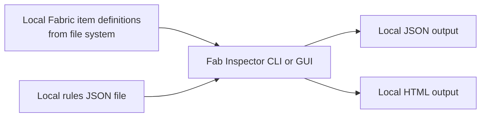
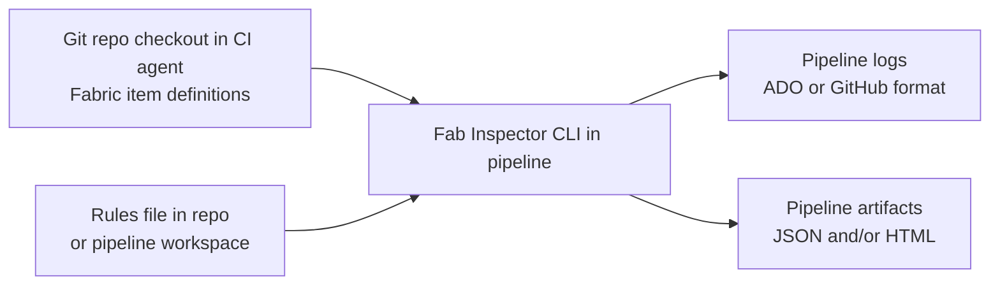
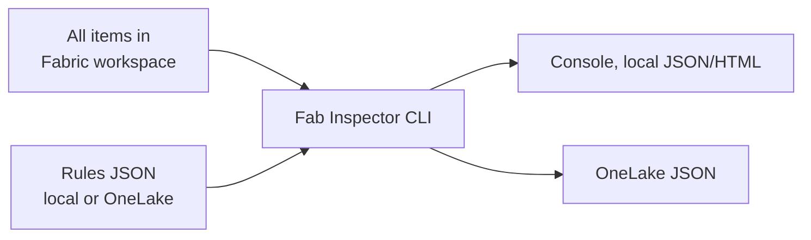
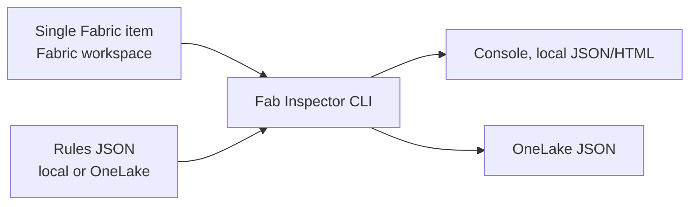
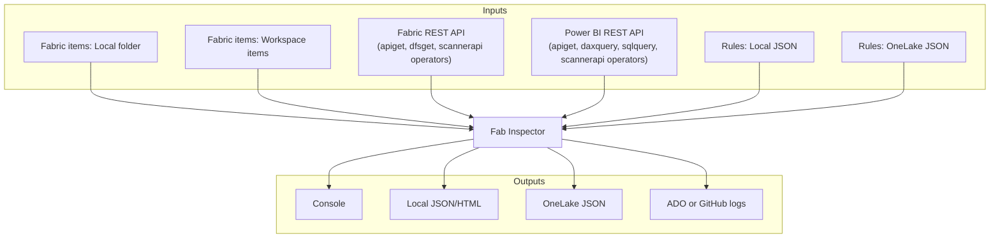
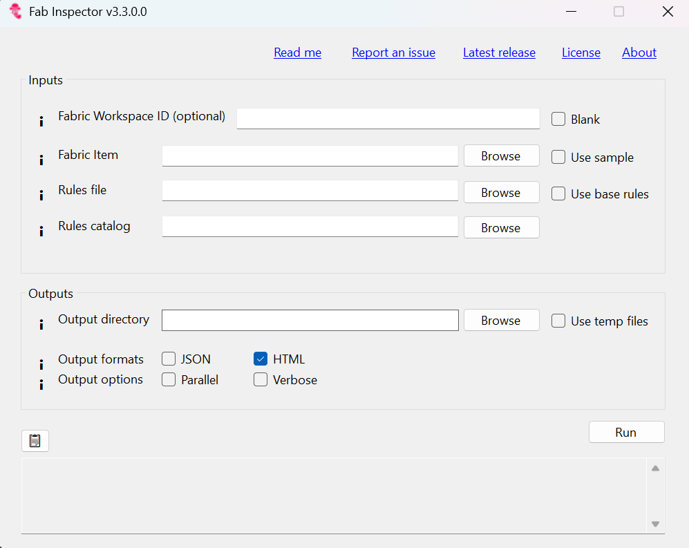
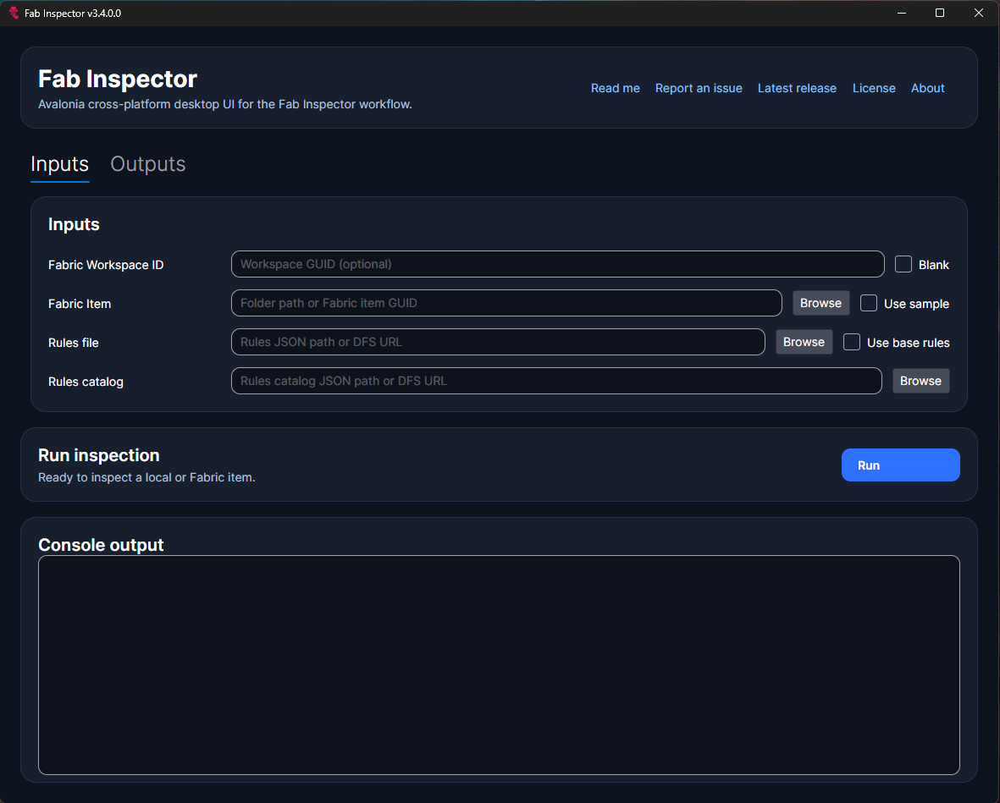

[](https://github.com/NatVanG/fab-inspector/actions/workflows/github-code-scanning/codeql)
[](https://github.com/NatVanG/fab-inspector/actions/workflows/tests.yml)
[](https://github.com/NatVanG/fab-inspector/actions/workflows/docker-publish.yml)
# Fab Inspector

## Deterministic rules-based testing for Microsoft Fabric in the age of AI

Meet Ric, the Fab Inspector!

<div style="display: flex; gap: 20px; align-items: center;">
  
  
</div>

## NOTE :pencil:

This is a community project that is not supported by Microsoft.

:exclamation: When testing Power BI reports, Fab Inspector only supports the new enhanced metadata report format (PBIR). Also PBIX files are not currently supported, only PBIP or "{my-report}.Report" folders.

## Microsoft Fabric workload (preview)

A React + TypeScript frontend for the FabInspector custom Fabric workload built on the
[Fabric Extensibility Toolkit](https://learn.microsoft.com/en-us/fabric/extensibility-toolkit/extensibility-toolkit-overview)
and the `@ms-fabric/workload-client` SDK. It talks to the lifecycle / job
controllers exposed by `FabInspector.Web` over `/api/workload/*`.

## <a name="contents"></a>Contents

- [Intro](#intro)
- [Usage scenarios](#usage-scenarios)
- [Thanks](#thanks-pray)
- [Bugs](#bugs-beetle)
- [Breaking changes](#breaking-changes-boom)
- [Release notes](#release-notes-scroll)
- [Releases](#releases)
- [Base rules](#baserulesoverview)
- [Run from the GUI](#gui)
- [Run from the CLI](#cli)
- [Interpreting results](#results)
- [Azure DevOps and GitHub integration](#ado)
- [Custom rules guide](#customerruleguide)
- [Rule file examples](#customrulesexamples)
- [Create and debug rules with VS Code](#rulecreationwithvscode)
- [Wiki](#wiki)
- [Known issues](#knownissues)
- [Report an issue](#reportanissue)

### Documentation

| Document | Description |
|---|---|
| [CLI Reference](docs/cli-reference.md) | All CLI parameters, authentication options, and command examples |
| [Rules Guide](docs/rules-guide.md) | Rule object structure, test logic, patching, and worked examples |
| [Operators Overview](docs/operators-overview.md) | When to use Ric vs FabInspector operators; shared conventions |
| [Ric Operators](DocsExamples/Ric-Operators.md) | Navigation, data, string, set, layout, date/time, and file-system operators |
| [FabInspector Operators](DocsExamples/FabInspector-Operators.md) | REST API, DAX, SQL, and OneLake DFS operators |
| [Architecture](FabInspector.Core/Architecture.md) | Inspection engine internals, DI composition, and concurrency model |

## <a id="intro"></a>Intro

Fab Inspector is a deterministic validator for Microsoft Fabric deployments. It lets teams codify quality expectations as JSON rules, run those rules against local files or published workspace items, and produce repeatable pass/fail results that are easy to automate.

In practice, Fab Inspector acts like a unit test runner for Fabric artifacts. Instead of asserting behavior in application code, you assert metadata contracts: naming conventions, report design guardrails, CopyJob and DataPipeline settings and even API-derived checks via built-in operators. The result is policy-as-code for Fabric solutions, with outputs that fit both developer feedback loops and enterprise pipelines.

Rules are expressed as declarative JSON rather than imperative scripts or custom code. This has practical advantages over alternatives such as PowerShell scripts, Python notebooks, or hard-coded validation logic:

- **No compilation or runtime dependencies** — rules are plain JSON files that any text editor, version control system, or LLM can read, generate, and diff without a build step.
- **Separation of concerns** — validation intent lives outside application code, so rules evolve independently and can be owned by different personas (architects, governance teams, or AI agents).
- **Composable and parameterised** — rules support variables, conditional logic via [JSONLogic](https://jsonlogic.com/), and operator extensions (REST API calls, DAX queries, OneLake reads) without writing code.
- **Portable** — the same JSON rules file runs locally on a developer's machine, in Azure DevOps pipelines, and in GitHub Actions with no modification.
- **AI-friendly** — the declarative structure is easy for language models to generate, review, and explain, making rules a natural artefact in agentic workflows.

Fab Inspector is designed with agentic development workflows in mind. AI agents can generate or refactor Fabric items quickly, but speed and non-deterministic outputs increase the need for reliable validation gates. Fab Inspector provides such gates by:

- validating agent-produced artifacts before merge or deployment
- enforcing team standards consistently across item types
- surfacing actionable failures in Console, HTML, JSON, Azure DevOps, or GitHub formats
- optionally logging validation results as JSON to Fabric OneLake for post-hoc reporting
- enabling fast local checks and scalable CI/CD quality controls with the same rule model

Whether you are authoring rules locally, running checks in pull requests, or validating an entire Fabric workspace, Fab Inspector helps teams move faster with confidence by making quality requirements explicit, testable, and automatable.

## Usage scenarios

Fab Inspector supports local, workspace, and OneLake-based validation workflows. The scenarios below show common usage patterns and how inputs/outputs can be mixed.

| Scenario | Fabric items source | Rules source | Test results output targets | Auth method |
|---|---|---|---|---|
| 1. Local-only | Local folder | Local | Console, HTML, JSON | `local` |
| 2. CI/CD checkout | Git checkout on build agent | Local in repo | GitHub logs, JSON stored in OneLake | `local` or `federatedtoken` (GitHub OIDC) |
| 3. Workspace-scoped | All/some items in a Fabric workspace | Local or OneLake | Console or JSON stored in OneLake | `interactive`, `azurecli`, [`clientsecret`](#handling-client-secrets-safely), `certificate`, `federatedtoken`, or `managedidentity` |
| 4. Item-scoped workspace | Single item in a Fabric workspace | Local or OneLake | Console or JSON stored in OneLake | `interactive`, `azurecli`, [`clientsecret`](#handling-client-secrets-safely), `certificate`, `federatedtoken`, or `managedidentity` |

Rules input can be provided either as a single rules file (`-rules`) or as a rules catalog (`-rulescatalog`) that references multiple rulesets. The two options are mutually exclusive.

Rules catalog examples are available at [DocsExamples/Example-RulesCatalog.json](DocsExamples/Example-RulesCatalog.json).


### 1. Local Fabric item definitions + local rules + local output

Use this when developing rules or validating item definitions on your machine before committing code. Output formats: `Console`, `JSON`, `HTML`.



Typical command:

```bash
fab-inspector -fabricitem "C:\FabricProject" -rules "C:\Rules\MyRules.json" -output "C:\FabResults" -formats "Console,JSON"
```

### 2. Fabric item definitions in source control + local rules in CI/CD

Use this when a pipeline checks out a repository and runs quality gates as part of pull request or deployment validation. The `-formats ADO` or `-formats GitHub` option emits native CI log commands.

An easy way to run Fab Inspector on a GitHub Ubuntu runner is via the published `fab-inspector` Docker image — see the [example GitHub Actions workflow](https://github.com/NatVanG/fab-inspector-cicd-example/blob/main/.github/workflows/fab-inspector.yml).



Typical command (Azure DevOps):

```bash
fab-inspector -fabricitem "./FabricProject" -rules "./Rules/ci-rules.json" -formats "ADO"
```

### 3. Workspace-scoped: all items in a Fabric workspace

Use this to inspect every item in a Fabric workspace in a single run. Omit `-fabricitem` to target the whole workspace. Rules and output can be hosted on OneLake.



Typical command (interactive auth):

```bash
fab-inspector -fabricworkspace "<workspace-guid>" -rules ".\Files\Base-rules.json" -authmethod interactive -formats "JSON,HTML"
```

GitHub Actions with federated token (OIDC) authentication, validating against a Fabric workspace in the pipeline:

```bash
fab-inspector -fabricworkspace "<workspace-guid>" -rules "./Rules/ci-rules.json" -authmethod federatedtoken -clientid "<client-id>" -tenantid "<tenant-id>" -federatedtoken "$ACTIONS_ID_TOKEN_REQUEST_TOKEN" -formats "GitHub"
```

With OneLake-hosted rules and results using [client secret authentication](#handling-client-secrets-safely):

```bash
fab-inspector -fabricworkspace "<workspace-guid>" -rules "https://onelake.dfs.fabric.microsoft.com/<workspace>/<lakehouse>/Files/rules/rules.json" -authmethod clientsecret -clientid "<client-id>" -tenantid "<tenant-id>" -clientsecret "<secret>" -output "https://onelake.dfs.fabric.microsoft.com/<workspace>/<lakehouse>/Files/results" -formats "JSON"
```

### 4. Item-scoped: single item in a Fabric workspace

Use this to target a specific published Fabric item by its GUID. Provide the item GUID via `-fabricitem`.



Typical command (interactive auth):

```bash
fab-inspector -fabricworkspace "<workspace-guid>" -fabricitem "<item-guid>" -rules ".\Files\Base-rules.json" -authmethod interactive -formats "Console"
```

CI/CD pipeline using [client secret authentication](#handling-client-secrets-safely):

```bash
fab-inspector -fabricworkspace "<workspace-guid>" -fabricitem "<item-guid>" -rules ".\Files\Base-rules.json" -authmethod clientsecret -clientid "<client-id>" -tenantid "<tenant-id>" -clientsecret "<secret>" -formats "ADO"
```

### 5. Hybrid pattern

Rules can call the Power BI/Fabric admin scanner API, the Power BI and Fabric REST APIs' GET methods, request JSON files from the OneLake DFS endpoint, or execute DAX and SQL queries directly from within rule logic using the [`apiget`](DocsExamples/FabInspector-Operators.md#apiget), [`dfsget`](DocsExamples/FabInspector-Operators.md#dfsget), [`daxquery`](DocsExamples/FabInspector-Operators.md#daxquery), [`sqlquery`](DocsExamples/FabInspector-Operators.md#sqlquery), and [`scannerapi`](DocsExamples/FabInspector-Operators.md#scannerapi) operators.



Example combinations:

1. Local item definitions + OneLake rules + local HTML output.
2. Workspace items + local rules + GitHub annotations.
3. Workspace items + OneLake rules + OneLake JSON output.
4. Workspace items + OneLake rules (including REST API, DAX, and SQL calls via operators) + OneLake JSON output.

This flexibility lets teams start local, then progressively adopt CI/CD, workspace-scoped inspection, and API-driven rules without changing the core rule model.

## Thanks :pray:

Thanks to [Michael Kovalsky](https://github.com/m-kovalsky) of [Semantic Link Labs](https://github.com/microsoft/semantic-link-labs) fame and [Rui Romano](https://github.com/ruiromano) for their feedback on the first iteration of this project. Thanks also to [Luke Young](https://www.linkedin.com/in/luke-young-2301/) for creating the original PBI Inspector logo and the new Fab Inspector version. 

Special thanks also to [David Mitchell](https://www.linkedin.com/in/davidmitchell85) for his unwavering support and advocacy of Fab Inspector. Check out [David's Microsoft blog post and tooling](https://www.microsoft.com/en-us/microsoft-fabric/blog/2024/12/02/automate-your-migration-to-microsoft-fabric-capacities/) for automating the migration of workspaces from Power BI Premium to Microsoft Fabric capacities.

## Bugs :beetle:

Please report issues [here](https://github.com/NatVanG/fab-inspector/issues).

## Breaking changes :boom:
**PBI Inspector v2.0.0**: To support the new enhanced report format (PBIR), a new "part" custom command has been introduced which helps to navigate to or iterate over the new metadata file format's parts such as "Pages", "Visuals", "Bookmarks" etc. Rules defined against the new format are not backward compatible with the older PBIR-legacy format and vice versa.

**PBI Inspector v2.4.2**: Rules' ```part``` iterator and ```part``` custom operator previously allowed for a regular expression to match one or more Fabric item file or folder path(s). As PBI Inspector V2 is now cross-platform, the regular expression would have needed to be platform-agnostic to work across both windows and linux file paths. Furthermore, either forward slashes and back slashes need to be escaped in regular expressions and JSONLogic. To simplify matters, Fabric items' folder paths have been "normalised" and the neutral column character i.e. ':' was chosen to act as folder separator instead therefore, as an example, the part iterator or operator can be set as follows: 

  ```"part":"folder1:.*:copyjob-content.json"``` 
   
  or 

  ```"part":"folder1:.*:copyjob-content\.json$"``` 

 to match a Fabric item path such as (on Windows OS):
 
 ```C:\fabricproject\folder1\copyjob1.CopyJob\copyjob-content.json```

 or on Linux OS:

 ```/home/fabricproject/folder1/copyjob1.CopyJob/copyjob-content.json```

## Release notes :scroll:

**PBI Inspector v2.3.0**: PBI Inspector V2 has evolved to support testing any Fabric items' CI/CD metadata, not just Power BI reports. Use either the Windows Forms desktop application or the CLI, which includes the `-fabricitem` option for targeting local or Fabric items and the `-help` option to list all supported CLI parameters. Here's an example rules file that tests a CopyJob Fabric item's metadata: [CopyJob Rules](DocsExamples/Example-CopyJob-Rules.json). Here's another example that tests metadata across Fabric item types: [Cross-Fabric Items Rule](DocsExamples/Example-FabricCrossItem-Rules.json).

**PBI Inspector v2.4.2**: The PBI Inspector V2 CLI is now cross-platform and can be run on both Linux and Windows. This is especially useful when run from either an Azure DevOps pipeline or from GitHub Actions. An easy way to run PBI Inspector V2 (aka Fab Inspector) on a GitHub Ubuntu runner is via the published "fab-inspector" Docker image, see an example GitHub action at https://github.com/NatVanG/fab-inspector-cicd-example/blob/main/.github/workflows/fab-inspector.yml.

The Console output as well as the Azure DevOps and GitHub outputs now include the file path of the current Fabric item being tested or failing a test. This is especically useful when pointing PBI Inspector V2 at a parent folder containing many reports and other Fabric items.

The `-parallel` option is now available with the CLI only as an experimental feature. See details in the [Run from the Command line (CLI)](#cli) section.

## <a id="releases"></a>Releases

See releases for the Windows application and Command Line interface (CLI) at: https://github.com/NatVanG/fab-inspector/releases.

## <a id="baserulesoverview"></a>Base rules

While Fab Inspector supports custom rules, it also includes the following base rules defined at https://github.com/NatVanG/fab-inspector/blob/main/Rules/Base-rules.json. Currently the base rules only test the visual layer of Power BI reports as opposed to other Fabric CI/CD items. Some base rules allow for user parameters as shown below:

1. Remove custom visuals which are not used in the report (no user parameters)
2. Reduce the number of visible visuals on the page (set parameter ```paramMaxVisualsPerPage``` to the maximum number of allowed visible visuals on the page)
3. Reduce the number of objects within visuals (override hardcoded ```6``` parameter value the maximum number of allowed objects per visuals)
4. Reduce usage of TopN filtering visuals by page (set ```paramMaxTopNFilteringPerPage```)
5. Reduce usage of Advanced filtering visuals by page (set ```paramMaxAdvancedFilteringVisualsPerPage```)
6. Reduce number of pages per report (override hardcoded ```10``` parameter value the maximum number of allowed pages per report)
7. Avoid setting ‘Show items with no data’ on columns (no user parameters)
8. Tooltip and Drillthrough pages should be hidden (no user parameters)
9. Ensure charts use theme colours (no user parameters)
10. Ensure pages do not scroll vertically (no user parameters)
11. Ensure alternativeText has been defined for all visuals (disabled by default, no user parameters)

To modify parameters, save a local copy of the Base-rules.json file at https://github.com/NatVanG/fab-inspector/blob/main/Rules/Base-rules.json and point Fab Inspector to the new file.

To disable a rule, edit the rule's json to specify ```"disabled": true```. At runtime Fab Inspector will ignore any disabled rule.

## <a id="gui"></a>Run from the graphical user interface (GUI)

Running ```FabInspector.WinForm.exe``` presents the user with the following interface: 



`FabInspector.AvaloniaUI` is the cross-platform desktop alternative in this solution. It is intended to mirror the WinForms workflow while using `FabInspector.ImageLibrary` for cross-platform report rendering and can be packaged for Windows, Linux and MacOS.



1. Specify the Workspace Id to test. Leave blank to test Fabric item definitions on the local file system.
2. If Workspace Id is blank, browse to a local Fabric CI/CD folder containing one or more Fabric CI/CD item definitions or paste the folder path. Alternatively if a Workspace ID is defined, optional scope the rules to a Fabric Item ID
3. Either use the base (Power BI) rules file included in the application or select your own local rules file or a DFS URL to a rules file in OneLake.
4. Use the "Browse" button to select a local output directory to which the results will be written. Another option is to specify a DFS URL to a folder in OneLake storage. Alternatively, select the "Use temp files" check box to write the resuls to a temporary local folder that will be deleted upon exiting the application.
5. Select output formats, either JSON or HTML or both. To simply view the test results in a formatted page select the HTML output.
6. Select "Verbose" to output both test passes and fails, if left unselected then only failed test results will be reported.  
7. Select "Run". The test run log messages are displayed at the bottom of the window. If "Use temp files" is selected (or the Output directory field is left blank) along with the HTML output check box, then the browser will open to display the HTML results.
8. Test run information, warnings or errors are displayed in the console output textbox.

## <a id="cli"></a>Run from the command line interface (CLI)

The `fab-inspector` CLI supports local file system mode and authenticated Fabric workspace mode. For the full parameter reference, authentication options, and command examples see **[CLI Reference](docs/cli-reference.md)**.

Quick examples:

```bash
# Local mode — single report
fab-inspector -fabricitem "C:\Files\Sales.Report" -rules ".\Files\Base-rules.json" -formats "Console,JSON"

# Workspace-scoped — interactive auth
fab-inspector -fabricworkspace "<workspace-guid>" -rules ".\Files\Base-rules.json" -authmethod interactive -formats "Console,JSON"

# CI/CD — GitHub Actions with OIDC
fab-inspector -fabricworkspace "<workspace-guid>" -rules "./Rules/ci-rules.json" -authmethod federatedtoken -clientid "<client-id>" -tenantid "<tenant-id>" -federatedtoken "$ACTIONS_ID_TOKEN_REQUEST_TOKEN" -formats "GitHub"

# Show all options
fab-inspector -help
```

## <a id="results"></a>Interpreting results

 If a verbose output was requested, then results for both test passes and failures will be reported. The JSON output is intended to be consumed by a subsequent process, for example a Power BI report may be created that uses the JSON file as a data source to visualise the Fab Inspector test results. The HTML page is a more readable format for humans and also includes report page wireframe images when tests are at the report page level. These images are intended to help the user identify visuals that have failed the test such as in the example image below. The Fab Inspector logo is also displayed at the centre of each failing visuals as an additional identification aid when the wireframe is busy. 


Visuals with a dotted border are visuals hidden by default as the following example:


## <a id="ado"></a>Azure DevOps and GitHub integration

The Fab Inspector CLI can be run as part of an Azure DevOps pipeline job. By specifying the "-formats ADO" command line option, the CLI will output Azure DevOps compatible task commands for use in a deployment pipeline. Fab Inspector rules definition can be given a "logType" attribute of either "warning" or "error" which will be passed to the Azure DevOps task command as follows: ```##vso[task.logissue type=warning|error]```.

Similarly, the Fab Inspector CLI can be run as part of a GitHub Actions workflow by using the "-formats GitHub" command line option. 

### Tutorials

For a tutorial on how to run Fab Inspector as part of an **Azure DevOps** pipeline job (alongside Tabular Editor's BPA rules), see https://learn.microsoft.com/en-us/power-bi/developer/projects/projects-build-pipelines.  ( :exclamation: Please note that to work with Fab Inspector in Azure DevOps the YAML file referenced in the tutorial needs to be updated as follows: [ContinuousIntegration-Rules-PBIR.yml](DocsExamples/ContinuousIntegration-Rules-PBIR.yml)).

For a tutorial on how to run Fab Inspector as part of a **GitHub Action** workflow using the **Fabric CLI** see https://github.com/RuiRomano/fabric-cli-powerbi-cicd-sample.

For a tutorial on how to run the Fab Inspector CLI as part of a **GitHub Action** workflow using the **[fabric-cicd](https://microsoft.github.io/fabric-cicd/latest/)** Python library, see https://github.com/RuiRomano/pbip-demo.

For a tutorial on how to run the Fab Inspector CLI (aka Fab Inspector) as part of a **GitHub Action** using a **Docker image** see the example repo at https://github.com/NatVanG/fab-inspector-cicd-example/blob/main/.github/workflows/fab-inspector.yml.

## <a id="customerruleguide"></a>Custom Rules Guide

:pencil: For the full guide to writing custom rules — rule object structure, test logic, `part` iterator, and worked examples — see **[Rules Guide](docs/rules-guide.md)**.

For a quick-reference of all available operators see:
- [Ric Operators](DocsExamples/Ric-Operators.md) — navigation, data transformation, string, set, layout/geometry, date/time, and file-system operators
- [FabInspector Operators](DocsExamples/FabInspector-Operators.md) — REST API (`apiget`, `dfsget`, `daxquery`, `sqlquery`, `scannerapi`) operators
- [Operators Overview](docs/operators-overview.md) — when to use Ric vs FabInspector operators

## <a id="customrulesexamples"></a>Rule File Examples

| File | Description |
|---|---|
| [Base Rules](Rules/Base-rules.json) | The set of rules that ships with Fab Inspector (Power BI report quality rules) |
| [Examples-rules.json](DocsExamples/Examples-rules.json) | Growing library of example rules |
| [Example-patches.json](DocsExamples/Example-patches.json) | Examples of patches to fix issues |
| [Example-CopyJob-Rules.json](DocsExamples/Example-CopyJob-Rules.json) | Rules to check CopyJob metadata |
| [Example-Environment-Rules.json](DocsExamples/Example-Environment-Rules.json) | Rules for Fabric Environment CI/CD items |
| [Example-FabricCrossItem-Rules.json](DocsExamples/Example-FabricCrossItem-Rules.json) | Rules across multiple Fabric item types |
| [Example-RulesCatalog.json](DocsExamples/Example-RulesCatalog.json) | Rules catalog referencing multiple rulesets |
| [RulesTemplate.json](DocsExamples/RulesTemplate.json) | Minimal rules file template |

For operator quick-reference and usage snippets see:
- [Ric Operators](DocsExamples/Ric-Operators.md) — all built-in JSON Logic extension operators
- [FabInspector Operators](DocsExamples/FabInspector-Operators.md) — REST API and layout operators requiring authentication

## <a id="rulecreationwithvscode"></a>Create and Debug Rules with VS Code

Check out the [Fab Inspector VS Code extension](https://github.com/NatVanG/fab-inspector-vscode-ext) and the demo video in the extension release [announcement post on LinkedIn](https://www.linkedin.com/posts/natvangulck_powerbi-microsoftfabric-microsoftfabriccicd-activity-7360220590856675328-NYDB).

## <a id="wiki"></a>Wiki

For an in-depth understanding of Fab Inspector rules and operators see the [Fab Inspector wiki](https://github.com/NatVanG/fab-inspector/wiki).

## <a id="knownissues"></a>Known issues

-  Currently page wireframes are only created in a 16:9 aspect ratio so custom report page sizes including tooltip pages may not render as expected as shown in the following tooltip page example. See tooltip page example below:
 
 

 - Currently page wireframes do not faithfully represents the report page layout when visual groups are present.


## <a id="reportanissue"></a>Report an issue

Please report issues at https://github.com/NatVanG/fab-inspector/issues.