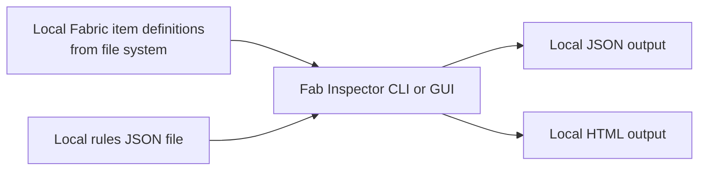
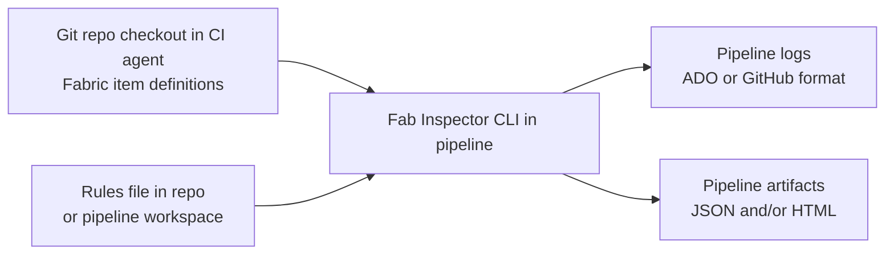
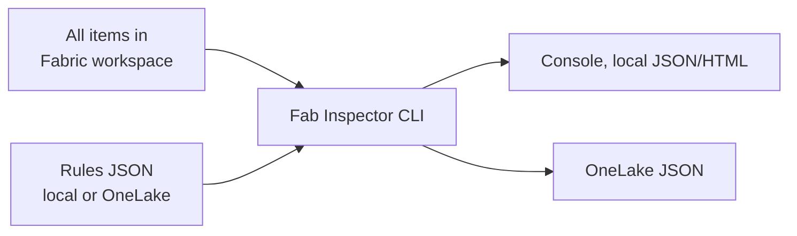
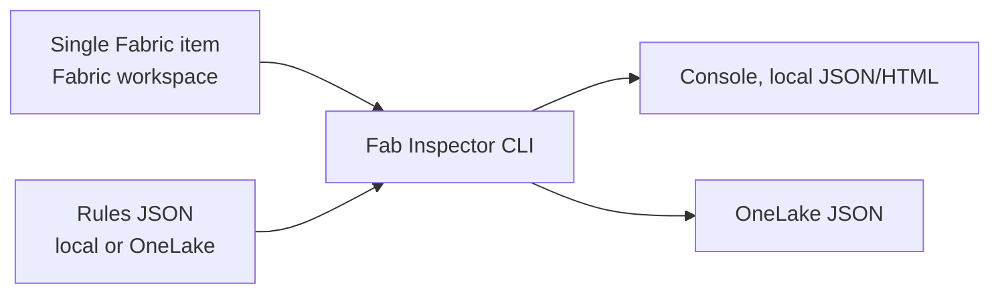
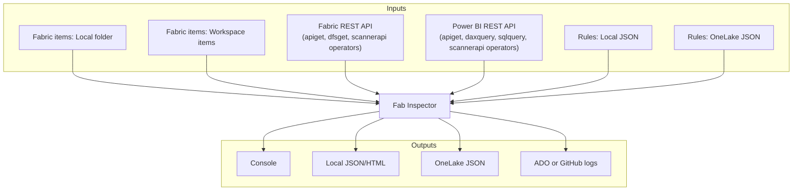

# Usage scenarios

Fab Inspector supports local, workspace, and OneLake-based validation workflows. The scenarios below show common usage patterns and how inputs/outputs can be mixed.

| Scenario | Fabric items source | Rules source | Test results output targets | Auth method |
|---|---|---|---|---|
| 1. Local-only | Local folder | Local | Console, HTML, JSON | `local` |
| 2. CI/CD checkout | Git checkout on build agent | Local in repo | GitHub logs, JSON stored in OneLake | `local` or `federatedtoken` (GitHub OIDC) |
| 3. Workspace-scoped | All/some items in a Fabric workspace | Local or OneLake | Console or JSON stored in OneLake | `interactive`, `azurecli`, [`clientsecret`](cli-reference.md#handling-client-secrets-safely), `certificate`, `federatedtoken`, or `managedidentity` |
| 4. Item-scoped workspace | Single item in a Fabric workspace | Local or OneLake | Console or JSON stored in OneLake | `interactive`, `azurecli`, [`clientsecret`](cli-reference.md#handling-client-secrets-safely), `certificate`, `federatedtoken`, or `managedidentity` |

Rules input can be provided either as a single rules file (`-rules`) or as a rules catalog (`-rulescatalog`) that references multiple rulesets. The two options are mutually exclusive.

Rules catalog examples are available at [DocsExamples/Example-RulesCatalog.json](../DocsExamples/Example-RulesCatalog.json).

## 1. Local Fabric item definitions + local rules + local output

Use this when developing rules or validating item definitions on your machine before committing code. Output formats: `Console`, `JSON`, `HTML`.



Typical command:

```bash
fab-inspector -fabricitem "C:\FabricProject" -rules "C:\Rules\MyRules.json" -output "C:\FabResults" -formats "Console,JSON"
```

## 2. Fabric item definitions in source control + local rules in CI/CD

Use this when a pipeline checks out a repository and runs quality gates as part of pull request or deployment validation. The `-formats ADO` or `-formats GitHub` option emits native CI log commands.

An easy way to run Fab Inspector on a GitHub Ubuntu runner is via the published `fab-inspector` Docker image - see the [example GitHub Actions workflow](https://github.com/NatVanG/fab-inspector-cicd-example/blob/main/.github/workflows/fab-inspector.yml).



Typical command (Azure DevOps):

```bash
fab-inspector -fabricitem "./FabricProject" -rules "./Rules/ci-rules.json" -formats "ADO"
```

## 3. Workspace-scoped: all items in a Fabric workspace

Use this to inspect every item in a Fabric workspace in a single run. Omit `-fabricitem` to target the whole workspace. Rules and output can be hosted on OneLake.



Typical command (interactive auth):

```bash
fab-inspector -fabricworkspace "<workspace-guid>" -rules ".\Files\Base-rules.json" -authmethod interactive -formats "JSON,HTML"
```

GitHub Actions with federated token (OIDC) authentication, validating against a Fabric workspace in the pipeline:

```bash
fab-inspector -fabricworkspace "<workspace-guid>" -rules "./Rules/ci-rules.json" -authmethod federatedtoken -clientid "<client-id>" -tenantid "<tenant-id>" -federatedtoken "$ACTIONS_ID_TOKEN_REQUEST_TOKEN" -formats "GitHub"
```

With OneLake-hosted rules and results using [client secret authentication](cli-reference.md#handling-client-secrets-safely):

```bash
fab-inspector -fabricworkspace "<workspace-guid>" -rules "https://onelake.dfs.fabric.microsoft.com/<workspace>/<lakehouse>/Files/rules/rules.json" -authmethod clientsecret -clientid "<client-id>" -tenantid "<tenant-id>" -clientsecret "<secret>" -output "https://onelake.dfs.fabric.microsoft.com/<workspace>/<lakehouse>/Files/results" -formats "JSON"
```

## 4. Item-scoped: single item in a Fabric workspace

Use this to target a specific published Fabric item by its GUID. Provide the item GUID via `-fabricitem`.



Typical command (interactive auth):

```bash
fab-inspector -fabricworkspace "<workspace-guid>" -fabricitem "<item-guid>" -rules ".\Files\Base-rules.json" -authmethod interactive -formats "Console"
```

CI/CD pipeline using [client secret authentication](cli-reference.md#handling-client-secrets-safely):

```bash
fab-inspector -fabricworkspace "<workspace-guid>" -fabricitem "<item-guid>" -rules ".\Files\Base-rules.json" -authmethod clientsecret -clientid "<client-id>" -tenantid "<tenant-id>" -clientsecret "<secret>" -formats "ADO"
```

## 5. Hybrid pattern

Rules can call the Power BI/Fabric admin scanner API, the Power BI and Fabric REST APIs' GET methods, request JSON files from the OneLake DFS endpoint, or execute DAX and SQL queries directly from within rule logic using the [`apiget`](../DocsExamples/FabInspector-Operators.md#apiget), [`dfsget`](../DocsExamples/FabInspector-Operators.md#dfsget), [`daxquery`](../DocsExamples/FabInspector-Operators.md#daxquery), [`sqlquery`](../DocsExamples/FabInspector-Operators.md#sqlquery), and [`scannerapi`](../DocsExamples/FabInspector-Operators.md#scannerapi) operators.



Example combinations:

1. Local item definitions + OneLake rules + local HTML output.
2. Workspace items + local rules + GitHub annotations.
3. Workspace items + OneLake rules + OneLake JSON output.
4. Workspace items + OneLake rules (including REST API, DAX, and SQL calls via operators) + OneLake JSON output.

This flexibility lets teams start local, then progressively adopt CI/CD, workspace-scoped inspection, and API-driven rules without changing the core rule model.
